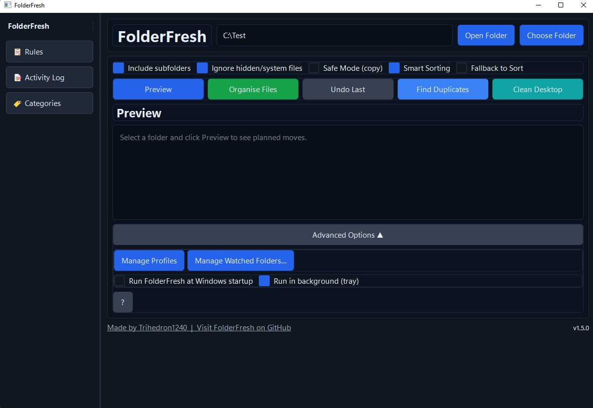
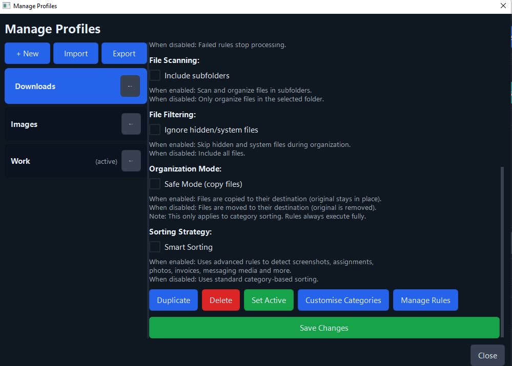
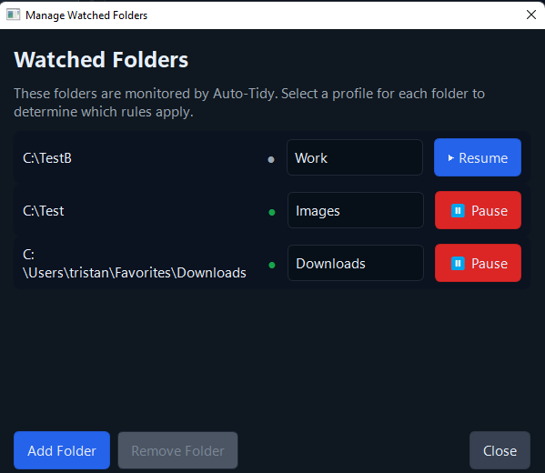
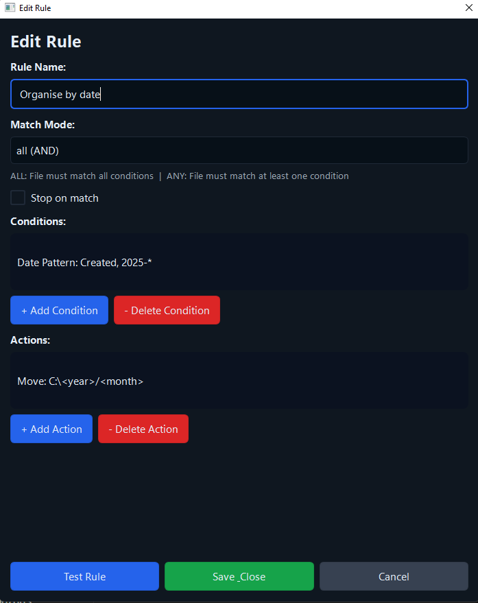
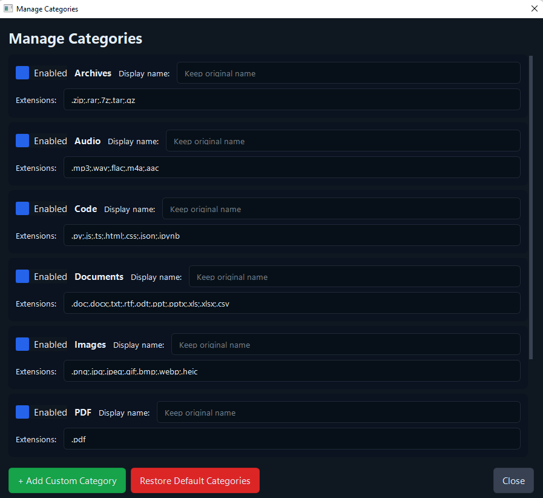
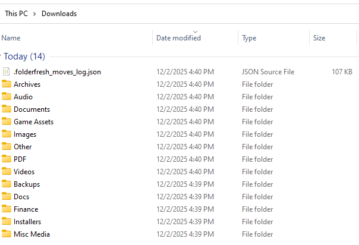

# FolderFresh — Intelligent File Automation Engine for Windows

## License
FolderFresh is licensed under **GPL-3.0**.
Versions prior to 1.4.0 remain under the MIT license they were originally released with.

Website: https://trihedron1240.github.io/FolderFresh/

FolderFresh is a **powerful, rule-based file automation engine** that intelligently organises, manages, and processes your files in real-time.
It's a full-featured automation tool for power users, developers, and anyone who needs advanced file management with complete control over their folder workflows.

---

## What's New in v2.0.0

Version 2.0.0 transforms FolderFresh from a folder cleaner into a **complete file automation platform**.

### Major New/Enhanced Features
#### **Complete architectural transition from customtkinter to PySide6 = Major graphical overhaul**

#### **Advanced Rule Engine** 
- Create powerful, reusable automation rules for complete file control
- **Multi-condition matching**: file name, size, date, path, metadata, etc
- **Flexible actions**: move, copy, rename, delete, archive
- **Priority-based execution**: rules run in order.
- **Test rules before applying**: preview impact on your files
- **Per-profile rules**: different automation for different folders

#### **Profile System with Per-Folder Mapping**
- Create multiple automation profiles (e.g., "Downloads", "Photography", "Development")
- Assign a **specific profile to each watched folder**
- Each folder gets its own rules, categories, and behaviors
- Switch profiles without stopping auto-sync
- Example:
  - `C:\Downloads` → "General" profile (rules for downloads)
  - `C:\Desktop` → "Work" profile (rules for work files)
  - `C:\Pictures` → "Photos" profile (rules for media)

#### **Real-Time Auto-Sync**
- Watches multiple folders simultaneously
- Each folder respects its assigned profile
- Waits for files to finish writing before processing
- Pause/resume without losing state

#### **Smart Category Sorting** (Fallback)
- When rules don't match, files sort into smart categories
- Auto-detects: screenshots, camera roll, messaging media, assignments, invoices, backups, edited media, project assets
- Fully customizable category names and file extensions

### Recent Improvements
- **Path normalization**: Fixed folder watching on Windows with case variations
- **Profile lookup**: Watcher now correctly uses assigned profile (not active profile)
- **Safe deletion**: Rules can delete files with explicit confirmation
- **Better logging**:Detailed activity log for debugging automation (WIP)
- **Stability**: Improved file state detection and race condition handling

---

## Core Features

### Rule-Based Automation Engine
- **Create custom rules** with flexible conditions and actions
- **Match by**: filename patterns, file size, creation/modification date, path, metadata, checksums
- **Act with**: move, copy, rename, delete (with confirmation), archive, tag
- **Priority execution**: rules run in order; first match wins
- **Test mode**: preview rule effects before applying to real files
- **Profile-specific rules**: different automation for different workflows

### Smart Category Sorting (Fallback)
- Auto-organises files when rules don't match (can be disabled)
- **Detects**: screenshots, camera roll, messaging media, assignments, invoices, backups, edited media, project assets
- Fully customizable category names and file extensions
- Sorts into: Documents, Images, Videos, Audio, Archives, Code, and more

### Real-Time File Watching
- **Auto-sort** files as they're created or modified
- **Multiple folders** with independent automation profiles
- **Safe writing**: waits for files to finish writing before processing
- **Cloud-safe**: works with OneDrive, Google Drive, Dropbox
- **Pause/Resume**: temporarily stop watching without losing configuration

### Safety & Control
- **Preview Mode**: see planned moves before applying
- **Undo History**: revert file operations within the same session (currently limited, will be enhanced in future)
- **Safe Mode**: copy files instead of moving (for category sorting)

### Additional Tools
- **Duplicate Finder**: identify duplicate files using fast hashing
- **Rule Simulator**: test rules on sample files before applying
- **Activity Log**: detailed automation history for debugging
- **Desktop Cleaner**: one-click cleanup of desktop
- **System Tray Mode**: minimize while maintaining background automation

---

## Example Folder Structure

Desktop

├─ Documents

├─ Images

├─ Videos

├─ Audio

├─ Archives

├─ Code

└─ Other


---

## Screenshots

### Main Window  


### Profile Manager  


### Watcher Manager 


### Rule Editor


### Rule Manager


### Category Manager


### Example



---

## Requirements
- Windows 10 or 11
- Python 3.11+
- pip

*(If using the installer, Python is not required.)*

## Installation

### From Source
```bash
git clone https://github.com/Trihedron1240/FolderFresh.git
cd FolderFresh
pip install -r requirements.txt
python -m src.main_qt_app
```

### Dependencies
- **PySide6** (Qt framework for UI)
- **watchdog** (file system monitoring)
- **pystray** (system tray integration)
- **Pillow** (image processing)

---

## Building From Source

1. Update the version number in `installer/FolderFresh.iss` and in `build.ps1`
2. Run `build.ps1` in PowerShell  
3. Open the updated `.iss` file in Inno Setup Compiler  
4. Build the installer

---

## Contributions

Pull requests, issues, and suggestions are welcome.  
FolderFresh is an open project made to help users stay organised effortlessly.

---

## AI Assistance Disclosure

Some UI and backend improvements were refined using AI-assisted development tools (Claude Code, Chatgpt).  
All logic has been manually reviewed, tested, and verified.  
No proprietary or third-party code is used.

