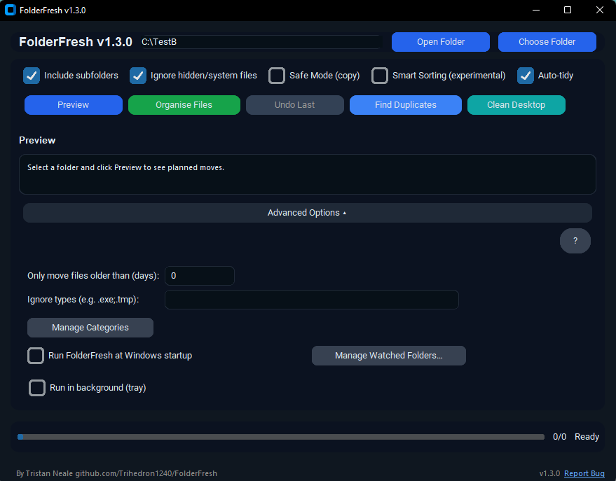
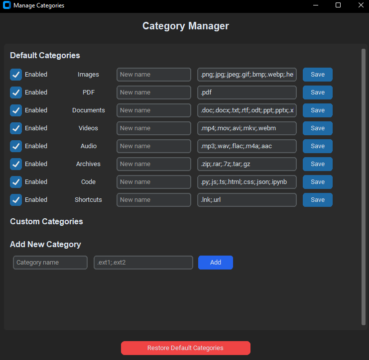
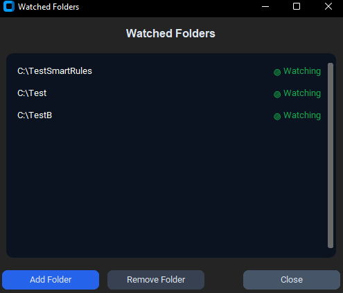

# FolderFresh — Smart Desktop & Folder Cleaner for Windows

Website: https://trihedron1240.github.io/FolderFresh/  

FolderFresh is a lightweight Windows utility that organises messy folders by sorting your files into clean, predictable categories.  
It’s built for students, creators, educators, and everyday Windows users who want a fast, **safe**, and **reversible** way to clean their Desktop, Downloads, or project folders.

FolderFresh **never deletes files**, and every action can be undone.

---

## What’s New in v1.3.0

Version 1.3.0 introduces major improvements:

- **Unified Category Manager** — create, disable, rename, and fully customise categories  
- **Custom Categories** — define your own categories with custom file extensions  
- **Enable/Disable Categories** — hide categories you don’t use  
- **Restore Defaults** — one-click reset to original category presets  
- **Multi-Folder Auto-Tidy** — watch multiple folders at once  
- **Improved Smart Sorting** — more accurate screenshot/photo/messaging/media detection  
- **New UI polish** and better Windows 11 styling  
- **Bug fixes & better stability**

---

## Features

### Core Sorting
- Sorts files into structured folders such as **Documents, Images, Videos, Audio, Archives, Code**, and **Other**.  
- Fully **customisable** category names and extensions.  
- **Preview mode** shows exactly what will be moved before organising.  
- **Undo** restores every moved file to its original location.  
- **Safe Mode** makes copies instead of moving files.

### Smart Sorting
Automatically detects:
- Screenshots  
- Camera roll photos  
- Messaging media (WhatsApp, Telegram, Signal, etc.)  
- Invoices & finance documents  
- Assignments and school work  
- Backups & duplicate versions  
- Edited videos  
- Game assets & project files  
- Large archives  
Smart Sorting uses intelligent rules — no configuration needed.

### Real-Time Auto-Tidy
- Automatically organises new files placed in watched folders.  
- Now supports **multiple watched folders**.  
- Skips partial downloads until fully written.  
- Respects ignore lists, hidden files, and age filters.

### Additional Tools
- **Duplicate Finder** using fast hashing.  
- **Age Filter** — only move files older than X days.  
- **Ignore List** for extensions you want excluded.  
- **One-click “Clean Desktop”** button.  
- Optional **system tray mode** for background operation.

---

## Example Folder Structure
Desktop

├─ Documents

├─ Images

├─ Videos

├─ Audio

├─ Archives

├─ Code

└─ Other

---

## Screenshots

### Main Window  

### Category Manager  

### Watch Folders  

---

## Requirements
- Windows 10/11  
- Python 3.10+  
- pip  

*(If using the installer, Python is not required.)*

---

## Building From Source

1. Update the version number in `installer/FolderFresh.iss`  
2. Run `build.ps1` in PowerShell  
3. Open the updated `.iss` file and build the installer  

---

## Safety Notes

FolderFresh is designed to be safe:
- **Never deletes files**  
- **Undo** restores all moved files  
- **Safe Mode** copies instead of moving  
- Cloud folders (OneDrive, Google Drive, etc.) may show sync activity, but files remain local  
- Auto-Tidy only processes **fully written** files  

---

## Contributions

Pull requests, feedback, and suggestions are welcome.  
FolderFresh is an open project created to help users stay organised with minimal effort.

---

## AI Assistance Disclosure

Some UI and backend improvements were refined using AI-assisted development tools.  
All logic has been manually reviewed, tested, and validated.  
No proprietary or third-party code is used.
