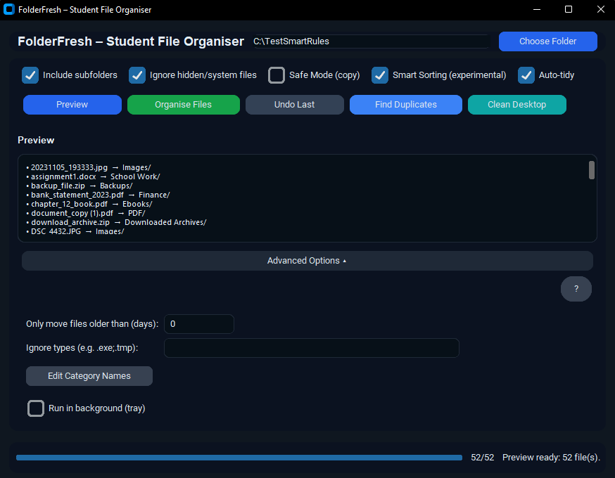

# FolderFresh — Desktop and Folder Cleaner for Windows

Website: https://trihedron1240.github.io/FolderFresh/  
Support (optional): https://trihedron.itch.io/folderfresh-1-click-desktop-folder-cleaner-windows

FolderFresh is a lightweight utility that organises messy folders by sorting files into simple, predictable categories.  
It is designed for Windows users who want a quick, safe way to clean their Desktop, Downloads, or project folders without risk.  
Nothing is deleted, and all actions can be undone.

This tool is intended for students, general Windows users, and anyone who prefers a clean, organised workspace.

---

## Features

- Sorts files into category folders such as Documents, Images, Videos, Audio, Archives, Code, and Other.
- Preview mode shows exactly what will be moved before anything happens.
- Undo restores every moved file back to its original location.
- Safe Mode copies files instead of moving them.
- Works on any folder (Desktop, Downloads, project folders, external drives, etc.).
- Progress bar and status messages to prevent the interface from freezing.
- Smart Sorting for recognising screenshots, assignments, invoices, photos, and other common patterns.
- Auto-tidy mode automatically organises new files as they appear.
- File age filter to only move older files.
- Ignore list for file types you do not want to touch.
- Duplicate finder with quick hashing.
- “Clean Desktop” one-click shortcut.

---

## Example Output Structure

Desktop
├─ Documents

├─ Images

├─ Videos

├─ Audio

├─ Archives

└─ Other

---

## Screenshots

**Before:**  

**Preview:**  

**After:**  

---

## Requirements

- Windows  
- Python 3.10+  
- pip  

---

## Create a build
1) update the version number in the .iss file
2) run build.ps1 with powershell
3) run the .iss file
## **Safety Notes**

Files are never deleted.

Undo restores all moved files.

Safe Mode can duplicate files instead of moving them.

OneDrive users may receive cloud messages when files move out of synced folders; files remain safely stored locally.

## **Build Status / Contributions**

Pull requests, issues, and suggestions are welcome.
This is an open project intended to help everyday users keep their machines organised.

## **AI Assistance Disclosure**

Some parts of the code were developed with the assistance of AI tools, then reviewed and tested manually.
No third-party proprietary code is included.
