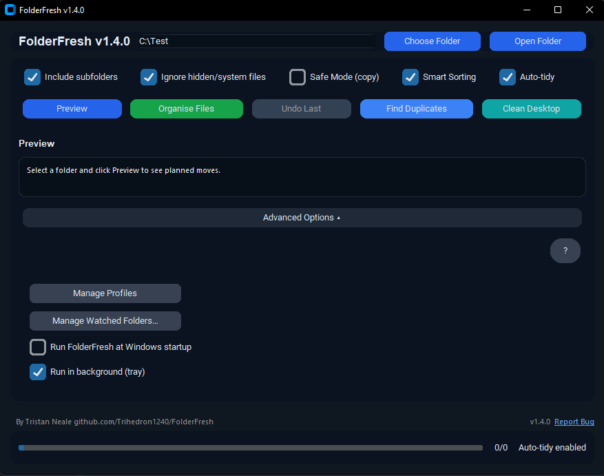
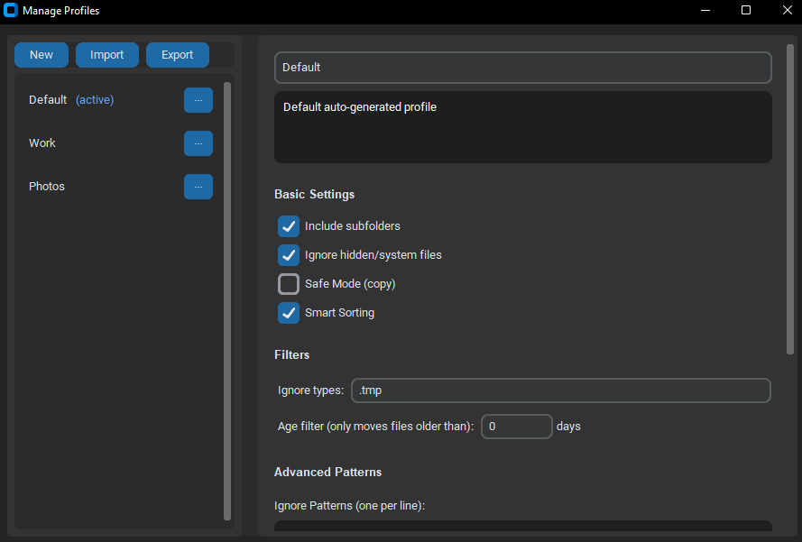
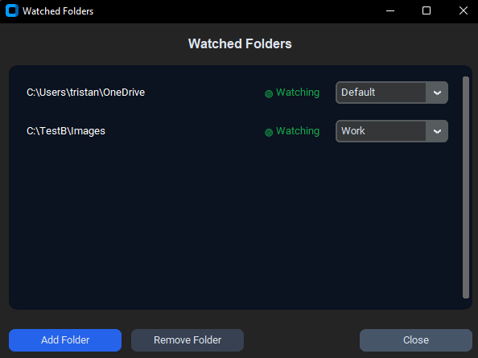

# FolderFresh — Smart Desktop & Folder Cleaner for Windows

## License
FolderFresh is licensed under **GPL-3.0**.  
Versions prior to 1.4.0 remain under the MIT license they were originally released with.  

Website: https://trihedron1240.github.io/FolderFresh/

### FolderFresh is a lightweight Windows utility that organises messy folders by sorting your files into clean, predictable categories.  
It’s built for students, creators, educators, and everyday Windows users who want a fast, **safe**, and **reversible** way to clean their Desktop, Downloads, or project folders.

FolderFresh **never deletes files**, and every action can be undone.

---

## What’s New in v1.4.0

Version 1.4.0 introduces the **biggest upgrade yet**, focused on reliability, flexibility, and power-user workflow improvements.

### Major New Features
- **Profile System**  
  Create multiple profiles with different sorting behaviors.  
  Switch instantly between presets like “School”, “Work”, “Photos”, or “Minimal”.

- **Per-Folder Profile Mapping**  
  Assign a *specific profile* to each watched folder.  
  Examples:  
  - Downloads → “General” profile  
  - Desktop → “Work” profile  
  - Screenshots → “Media” profile

- **Consistent & Reliable Auto-Tidy**  
  Huge stability improvements:  
  - starts correctly on launch  
  - continues working in tray mode  
  - recovers after restoring from tray  
  - fewer race conditions and dropped events

- **Ignore Patterns (Wildcard Matching)**  
  Exclude files by substring or glob-style patterns.  
  Examples:  
  - `backup`  
  - `*.tmp`  
  - `temp_*`  
  - `*draft*`

- **Don’t-Move List**  
  Files and paths that should **never** be touched.  
  More precise than ignore patterns.

### Enhancements & Fixes
- Watcher lifecycle improvements (no more silent failure).  
- Safer OneDrive/cloud placeholder handling.  
- Better merging between profile → global → runtime config.  
- Faster ignore checks and refined Smart Sorting behavior.  
- UI polish, spacing improvements, and more Windows 11 styling.

---

## Features

### Core Sorting
- Sorts files into structured folders (Documents, Images, Videos, Audio, Archives, Code, Other).  
- Fully **customisable** category names and extensions.  
- **Preview Mode** shows planned moves before organising.  
- **Undo** returns every file to its original location.  
- **Safe Mode** makes copies instead of moving.

### Smart Sorting
Automatically detects:
- Screenshots  
- Camera roll photos  
- Messaging media (WhatsApp, Telegram, Signal)  
- Assignments & school work  
- Invoices & PDFs  
- Backups/duplicate files  
- Edited media  
- Project/game assets  

Smart Sorting uses intelligent heuristics — no configuration required.

### Real-Time Auto-Tidy
- Auto-organise files in real time.  
- Supports multiple watched folders.  
- Each watched folder can have its **own profile**.  
- Delays sorting until files are fully written (safe for downloads).  
- Respects ignore patterns, don’t-move lists, age filters, and hidden/system filters.

### Additional Tools
- **Duplicate Finder** using fast hashing  
- **Age Filter** — skip files younger than X days  
- **Ignore Patterns** (`backup`, `*.tmp`, etc.)  
- **Don’t-Move List** (full protection for selected files)  
- **Clean Desktop** — one click  
- Optional **system tray mode**

---

## Example Folder Structure

Desktop

├─ Documents

├─ Images

├─ Videos

├─ Audio

├─ Archives

├─ Code

└─ Other

---

## Screenshots

### Main Window  

### Profile Manager  

### Watcher manager 

---

## Requirements
- Windows 10 or 11  
- Python 3.10+  
- pip  

*(If using the installer, Python is not required.)*

---

## Building From Source

1. Update the version number in `installer/FolderFresh.iss`  
2. Run `build.ps1` in PowerShell  
3. Open the updated `.iss` file in Inno Setup Compiler  
4. Build the installer

---

## Safety Notes

FolderFresh is designed for maximum safety:
- **Never deletes files**  
- **Undo** restores all moved files  
- **Safe Mode** copies instead of moving  
- Works safely inside cloud folders (OneDrive/Google Drive/Dropbox)  
- Auto-Tidy only processes **fully written** files  

---

## Contributions

Pull requests, issues, and suggestions are welcome.  
FolderFresh is a community-driven project made to help users stay organised effortlessly.

---

## AI Assistance Disclosure

Some UI and backend improvements were refined using AI-assisted development tools, namely Claude Code and Chatgpt.  
All logic has been manually reviewed, tested, and verified.  
No proprietary or third-party code is used.

