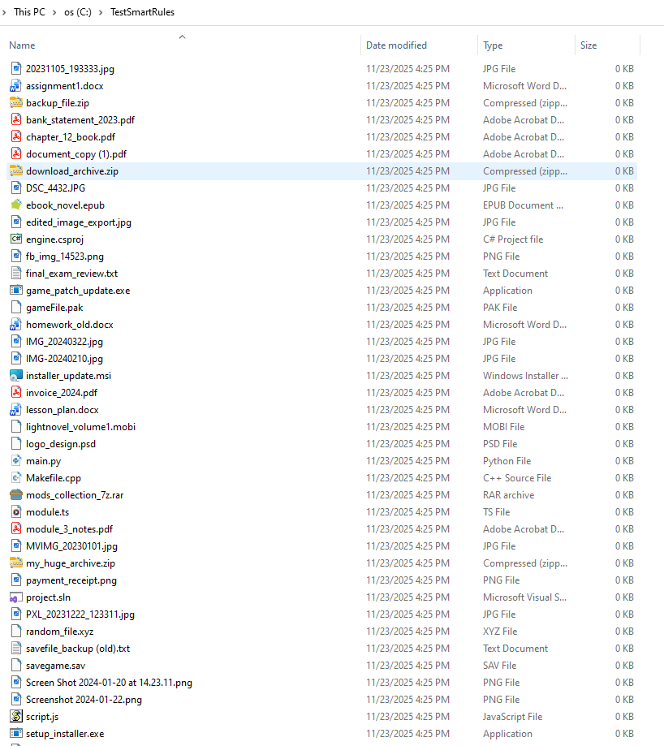
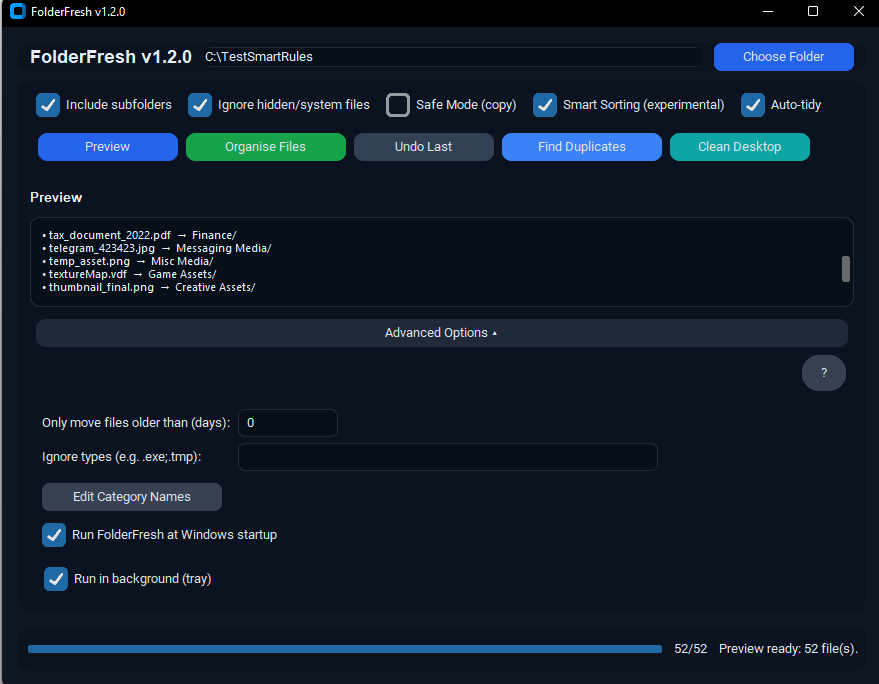
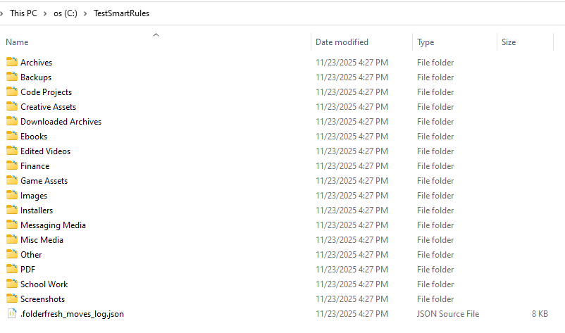

# FolderFresh — Desktop and Folder Cleaner for Windows

Website: https://trihedron1240.github.io/FolderFresh/  
Support (optional): https://trihedron.itch.io/folderfresh-1-click-desktop-folder-cleaner-windows

FolderFresh is a lightweight utility that organises messy Windows folders by sorting files into simple, predictable categories.  
It is designed for students, educators, and general Windows users who want a quick, safe method to clean their Desktop, Downloads, or project folders without risk.  
Files are never deleted, and every action can be undone.

---

## Features (v1.2.0)

### Core Sorting
- Sorts files into clean category folders such as Documents, Images, Videos, Audio, Archives, Code, and Other.
- Custom folder names for simple sorting (e.g., rename “Documents” → “School Work”).
- Preview mode shows exactly what will happen before organising.
- Undo restores every moved file to its original location.
- Safe Mode can make copies instead of moving files.

### Smart Sorting
- Detects screenshots, camera photos, messaging media, invoices, assignments, backups, edited videos, game assets, and more.
- Smart Sorting uses intelligent, predefined categories.
- Simple Sorting uses user-defined custom folder names.

### Auto-Tidy (Real-Time Monitoring)
- Automatically sorts new files that appear in the selected folder.
- Handles partially downloaded files safely.
- Respects ignore lists and age filters.

### Additional Utilities
- Duplicate Finder using fast hashing.
- Age filter to only move files older than a chosen number of days.
- Ignore list for file types you want excluded.
- One-click “Clean Desktop” mode.
- System tray mode for background operation.

---

## Example Folder Structure

Desktop
├─ Documents

├─ Images

├─ Videos

├─ Audio

├─ Archives

└─ Other

---

## Screenshots

**Before:**  

**Preview:**  

**After:**  

---

## Requirements

- Windows  
- Python 3.10+  
- pip  

---

## Create a build
1) update the version number in the .iss file
2) run build.ps1 with powershell
3) run the .iss file

## Safety Notes

FolderFresh never deletes files.

Undo restores all files moved by the last organise action.

Safe Mode creates copies instead of moving files.

OneDrive and cloud folders may show sync messages when files move; files remain stored locally.

Auto-tidy will only process stable, fully written files.

## **Build Status / Contributions**

Pull requests, issues, and suggestions are welcome.
This is an open project intended to help everyday users keep their machines organised.

## AI Assistance Disclosure

Portions of the UI and backend architecture were refined using AI-assisted development tools.
All logic has been reviewed, tested, and verified manually.
No proprietary third-party code is used.
