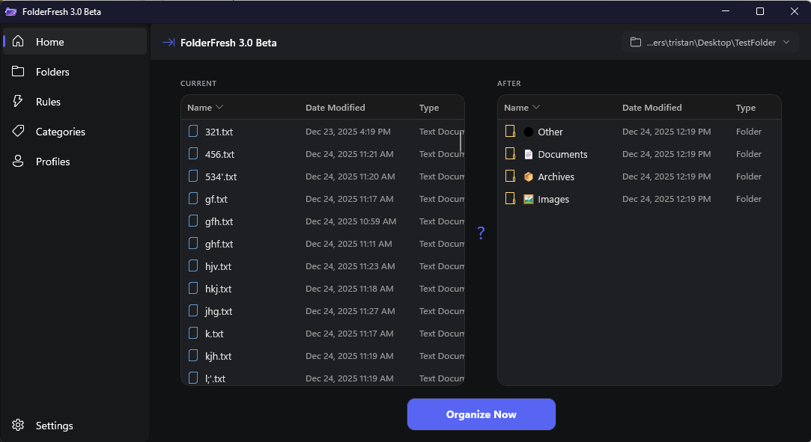
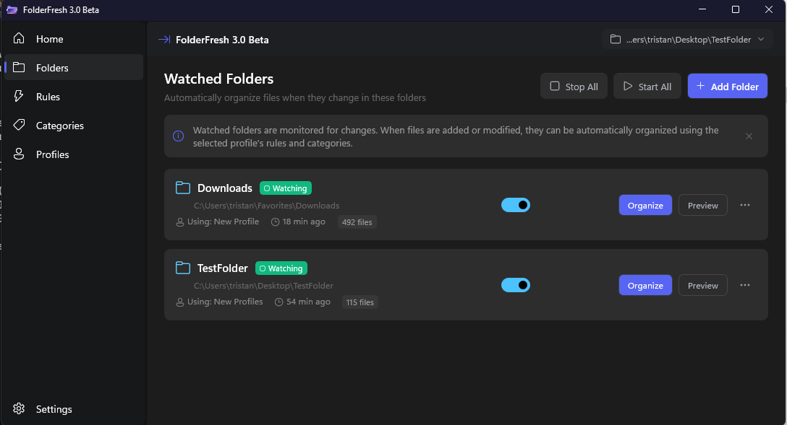
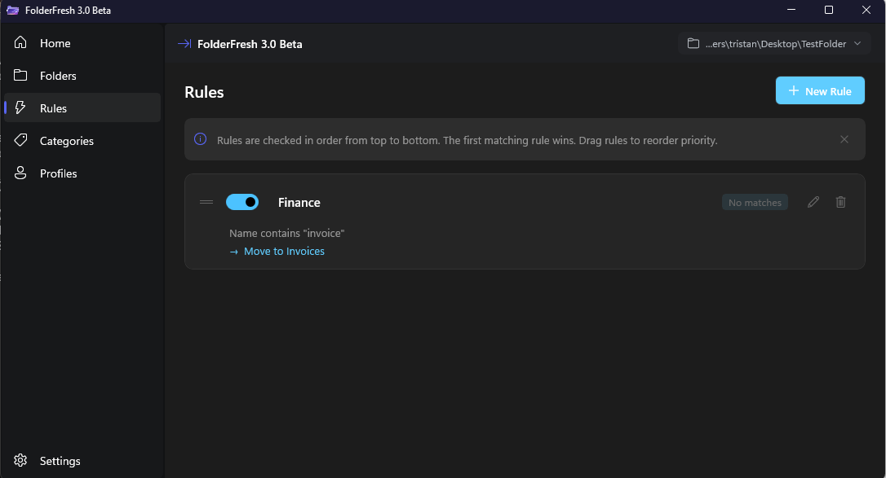
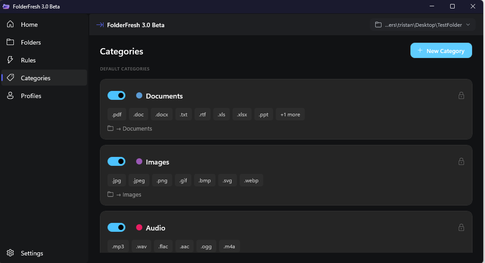
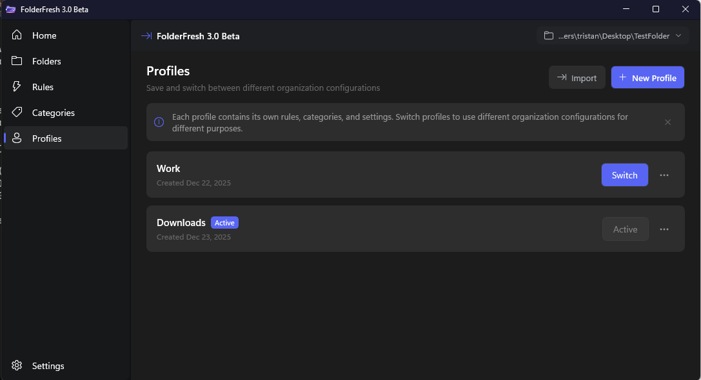
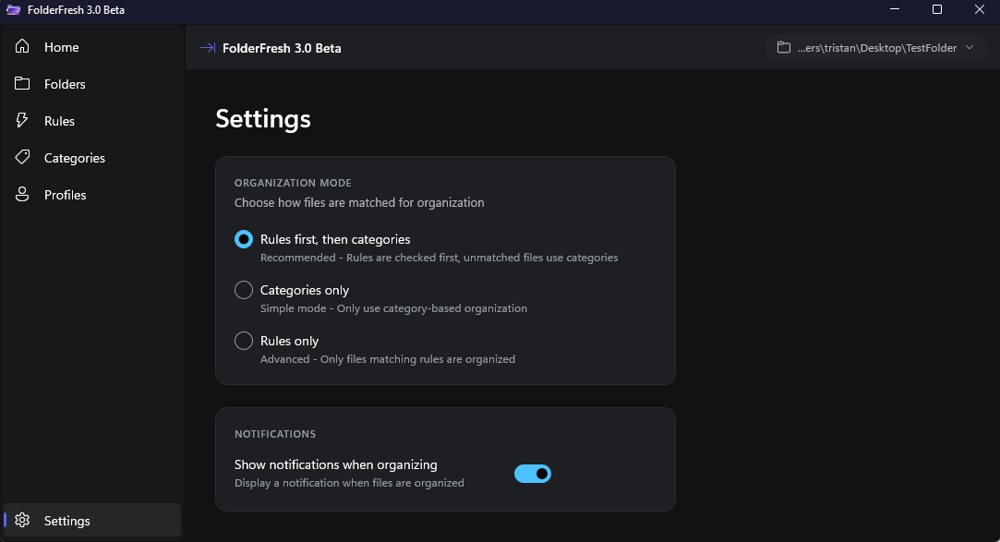

# FolderFresh 3.0 Beta — Intelligent File Automation Engine for Windows

## License
FolderFresh is licensed under **GPL-3.0**.
Versions prior to 1.4.0 remain under the MIT license they were originally released with.

Website: https://trihedron1240.github.io/FolderFresh/

FolderFresh is a **powerful, rule-based file automation engine** that intelligently organises, manages, and processes your files in real-time.
It's a full-featured automation tool for power users, developers, and anyone who needs advanced file management with complete control over their folder workflows.

---

## What's New in v3.0.0 Beta

Version 3.0.0 is a **complete rewrite** of FolderFresh, rebuilt from the ground up using modern Windows technologies for superior performance, reliability, and native integration.

> **Note:** This is a beta release. Some features may be incomplete or subject to change. Please report any bugs or issues on the [GitHub Issues](https://github.com/Trihedron1240/FolderFresh/issues) page.

### Major Changes

#### **Complete Platform Modernization**
- **Rebuilt in C# / .NET 9** — Native Windows performance replacing Python
- **WinUI 3 Interface** — Modern Fluent Design UI with smooth animations
- **Native Windows Integration** — Toast notifications, system tray, registry startup
- **Async Architecture** — Non-blocking operations throughout for a responsive experience

#### **Enhanced Rule Engine**
- **Advanced Pattern Matching** — Full regex support with case sensitivity options
- **Date Range Conditions** — Match files by creation/modification date ranges
- **Multiple Actions Per Rule** — Execute several actions when a rule matches
- **Dynamic Placeholders** — Use `{date:format}`, `{extension}`, `{counter}`, `{name}` in destinations

#### **Profile System Overhaul**
- **Complete Configuration Snapshots** — Each profile stores rules, categories, and settings
- **Instant Profile Switching** — Change entire automation setups with one click
- **Profile-Folder Linking** — Assign specific profiles to watched folders
- **Import/Export Ready** — JSON-based storage for easy backup and sharing

#### **Real-Time Watched Folders**
- **Intelligent Debouncing** — Waits for file writes to complete before processing
- **Loop Prevention** — Tracks recently organized files to prevent infinite loops
- **Per-Folder Status** — See watching/organizing/error state for each folder
- **Independent Profiles** — Each watched folder can use a different profile
- **Subfolder Support** — Optionally monitor subdirectories

#### **Windows Toast Notifications**
- **Native Notifications** — Proper Windows 10/11 toast notifications
- **Organization Alerts** — Get notified when files are automatically organized
- **Error Notifications** — Know immediately when a watcher encounters issues
- **Works in Tray Mode** — Notifications appear even when minimized to tray

#### **System Tray Integration**
- **Minimize to Tray** — Keep FolderFresh running without taskbar clutter
- **Close to Tray** — X button minimizes instead of closing
- **Start Minimized** — Launch silently on Windows startup
- **Quick Controls** — Pause/resume all watchers from tray context menu

#### **Modern Dark Theme**
- **Discord-Inspired Design** — Familiar dark purple aesthetic
- **Consistent Styling** — Unified look across all components
- **High Contrast Text** — Excellent readability in all conditions

---

## Core Features

### Rule-Based Automation Engine
- **Create custom rules** with flexible conditions and actions
- **Match by**: filename patterns (regex/glob), file size, creation/modification date, path depth, file content, extension
- **Operators**: contains, starts with, ends with, equals, regex, greater/less than, date ranges, and more
- **Act with**: move, copy, rename, delete, sort into subfolders
- **Condition Groups**: nest conditions with AND/OR/NONE logic for complex matching
- **Priority execution**: rules run in order; first match wins
- **Test mode**: preview rule effects before applying to real files
- **Profile-specific rules**: different automation for different workflows

### Smart Category Sorting (Fallback)
- Auto-organises files when rules don't match (can be disabled)
- **Default categories**: Documents, Images, Audio, Video, Archives, Other
- **Visual icons**: Each category has a distinctive emoji
- **Customizable**: Change names, colors, extensions, and destination folders
- Sorts by file type with intelligent extension mapping

### Real-Time File Watching
- **Auto-organize** files as they're created or modified
- **Multiple folders** with independent automation profiles
- **Safe writing**: 1-second debounce ensures files finish writing before processing
- **Status indicators**: See if each folder is idle, watching, organizing, or has errors
- **Pause/Resume**: Stop all watchers globally from system tray

### Profiles
- **Create multiple profiles** for different workflows (Downloads, Work, Photography, etc.)
- **Complete snapshots**: Each profile saves its own rules, categories, and settings
- **Quick switching**: Change your entire setup instantly
- **Folder mapping**: Assign different profiles to different watched folders

### Safety & Control
- **Preview Mode**: See exactly what will happen before organizing
- **Undo History**: Revert recent file operations
- **Trash Support**: Optionally move deleted files to Recycle Bin instead of permanent delete

### System Integration
- **System Tray**: Minimize or close to tray, start minimized
- **Windows Startup**: Optionally launch FolderFresh when Windows starts
- **Toast Notifications**: Native Windows notifications for organize events
- **Modern UI**: WinUI 3 with Fluent Design principles

---

## Example Folder Structure

```
Desktop
├── Documents
├── Images
├── Videos
├── Audio
├── Archives
└── Other
```

---

## Screenshots

### Home

### Watched Folders

### Rules

### Categories

### Profiles

### Settings

---

## Requirements

- **Windows 10** (version 1809 or later) or **Windows 11**
- **x64 processor**
- .NET 9.0 Runtime (included in installer)

---

## Installation

### From Installer (Recommended)
Download the latest installer from the [Releases](https://github.com/Trihedron1240/FolderFresh/releases) page.

### From Source
```bash
git clone https://github.com/Trihedron1240/FolderFresh.git
cd FolderFresh/FolderFreshLite
dotnet restore
dotnet build
dotnet run
```

### Dependencies (Handled by NuGet)
- **Microsoft.WindowsAppSDK** — WinUI 3 framework
- **Microsoft.Windows.SDK.BuildTools** — Windows SDK integration
- **System.Text.Json** — JSON serialization

---

## Building From Source

### Prerequisites
- Visual Studio 2022 (17.8+) with ".NET Desktop Development" workload
- Windows App SDK extension
- .NET 9.0 SDK

### Build Steps
1. Open `FolderFreshLite.sln` in Visual Studio
2. Select `Release` configuration and `x64` platform
3. Build → Build Solution (Ctrl+Shift+B)
4. Output will be in `bin/Release/net9.0-windows10.0.22621/`

### Creating Installer
1. Build in Release mode
2. Run the Inno Setup script in the `installer/` folder
3. Installer will be created in the output directory

---

## Configuration

All settings are stored in `%APPDATA%\FolderFresh\`:


---

## Migration from v2.0

Version 3.0 is a complete rewrite and does not automatically migrate settings from v2.0. You will need to:
1. Note your existing rules and categories in v2.0
2. Recreate them in v3.0 using the new rule editor
3. Set up your watched folders and profiles


---


## Contributions

Pull requests, issues, and suggestions are welcome.
FolderFresh is an open project made to help users stay organised effortlessly.

---

## AI Assistance Disclosure

Some UI and backend improvements were refined using AI-assisted development tools (Claude Code, ChatGPT).
All logic has been manually reviewed, tested, and verified.
No proprietary or third-party code is used.

---

## Version History

### v3.0.0 Beta (2025)
- Complete rewrite in C# / .NET 9 with WinUI 3
- Profile system with complete configuration snapshots
- Native Windows toast notifications
- System tray integration with minimize/close to tray
- Modern Fluent Design dark theme
- Significant performance improvements and fixes

### v2.0.0
- Transition from customtkinter to PySide6
- Advanced rule engine with multi-condition matching
- Profile system with per-folder mapping
- Real-time auto-sync with multiple folders
- Smart category sorting with auto-detection

### v1.x
- Initial releases with basic file organization
- Category-based sorting
- Simple UI with customtkinter
