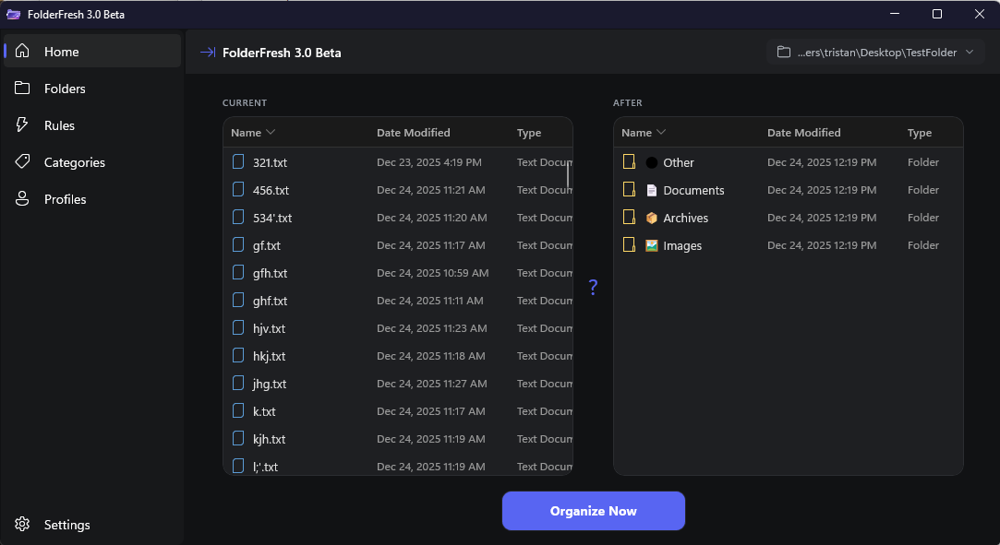
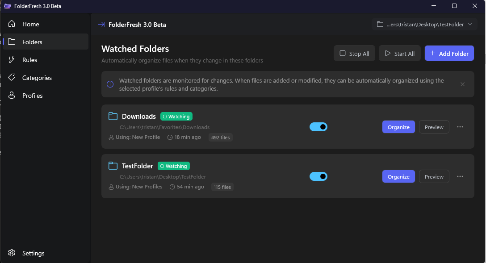
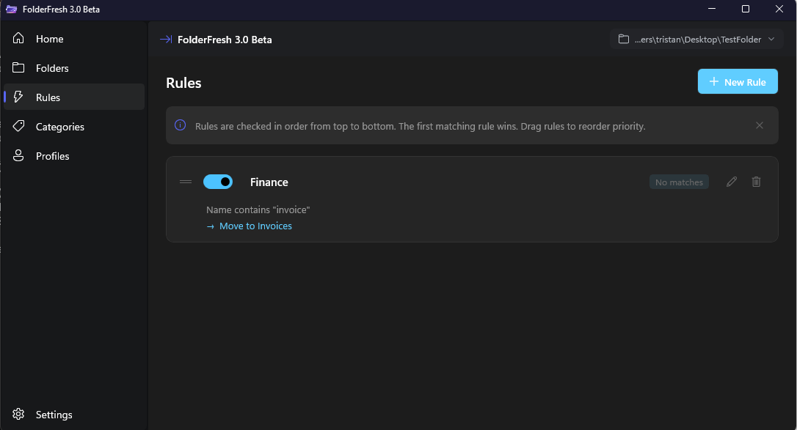
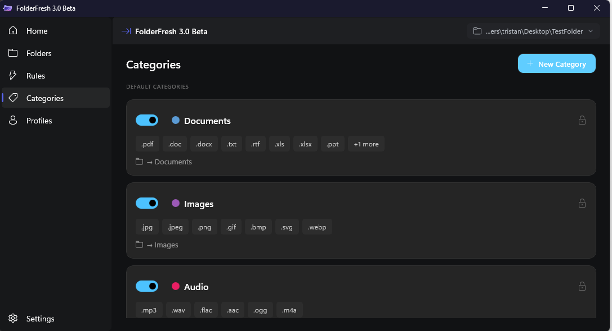
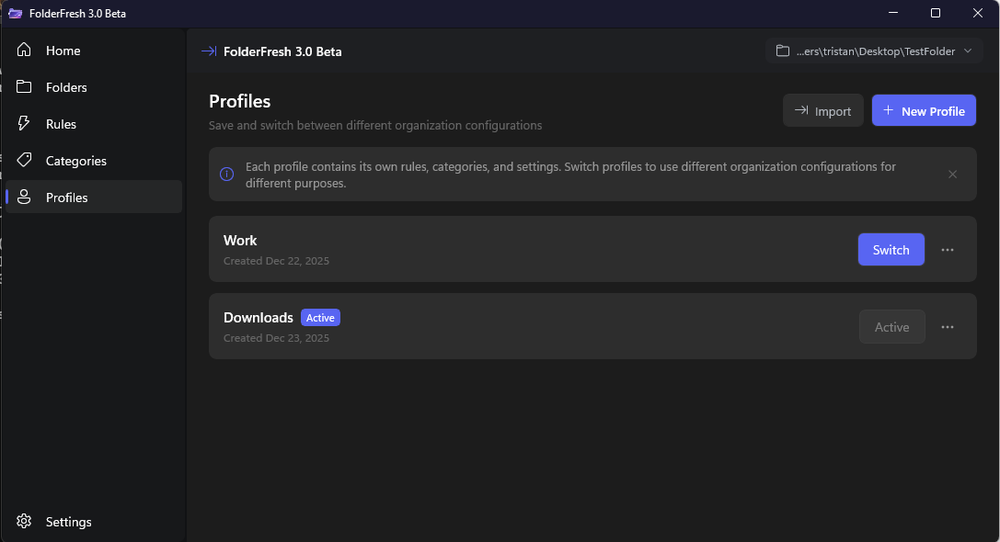
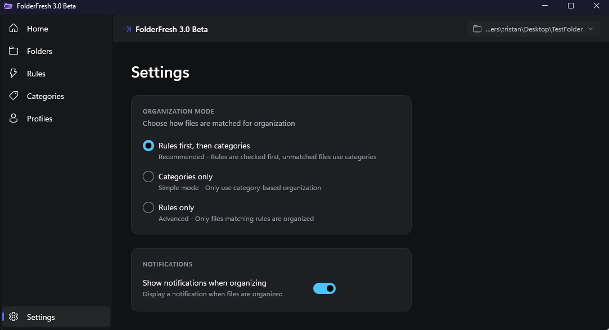

# FolderFresh 3.0.3 - Intelligent File Automation Engine for Windows

## License
FolderFresh is licensed under **GPL-3.0**.
Versions prior to 1.4.0 remain under the MIT license they were originally released with.

Website: https://trihedron1240.github.io/FolderFresh/

FolderFresh is a powerful, rule-based file automation engine that intelligently organizes, manages, and processes your files in real time.
It is built for power users, developers, and anyone who wants precise control over folder workflows on Windows.

---

## What's New in v3.0.3

FolderFresh 3.0 is a complete rewrite, rebuilt from the ground up using modern Windows technologies for better performance, reliability, and native integration.

Version 3.0.3 adds important fixes and release polish:

- Improved Windows App SDK launch reliability and desktop packaging
- Restored icon behavior for the app window, taskbar, and packaged executable
- Added Vietnamese localization support
- Fixed rule, category, and settings persistence issues
- Fixed excluded folder handling and empty-folder preservation behavior
- Added OpenDocument default category support for `.odt`, `.ods`, and `.odp`
- Enabled editing for default categories

### Major Changes in 3.x

#### Complete Platform Modernization
- Rebuilt in C# / .NET 9
- WinUI 3 interface with modern Fluent styling
- Native Windows integration for notifications, startup, and tray behavior
- Async architecture for responsive file operations

#### Enhanced Rule Engine
- Advanced pattern matching with regex and flexible text operators
- Date range conditions
- Multiple actions per rule
- Dynamic placeholders such as `{date:format}`, `{extension}`, `{counter}`, and `{name}`

#### Profile System Overhaul
- Complete configuration snapshots
- Instant profile switching
- Profile-to-folder mapping
- JSON-backed import and backup friendly storage

#### Real-Time Watched Folders
- Debounced file handling
- Loop prevention
- Per-folder status tracking
- Independent profiles per watched folder
- Optional subfolder support

#### Windows Integration
- Native toast notifications
- System tray support
- Start minimized and close/minimize to tray behavior

---

## Core Features

### Rule-Based Automation Engine
- Create custom rules with flexible conditions and actions
- Match by filename patterns, file size, created/modified date, path, content, and extension
- Use operators such as contains, starts with, ends with, equals, regex, greater/less than, and date ranges
- Perform move, copy, rename, delete, and sort-into-subfolder actions
- Group conditions with AND / OR / NONE logic
- Preview rule effects before applying them

### Smart Category Sorting
- Auto-organizes files when rules do not match
- Default categories: Documents, Images, Audio, Video, Archives, Other
- Customizable names, colors, icons, extensions, and destination folders
- Fallback category support for unmatched files

### Real-Time File Watching
- Automatically organizes files as they are created or modified
- Supports multiple watched folders with independent automation profiles
- Uses safe write debouncing before processing files
- Includes pause/resume support and per-folder state

### Profiles
- Multiple profiles for different workflows
- Each profile stores its own rules, categories, and settings
- Quick profile switching

### Safety and Control
- Preview mode
- Undo history
- Optional Recycle Bin support for deletes

---

## Example Folder Structure

```text
Desktop
|- Documents
|- Images
|- Videos
|- Audio
|- Archives
`- Other
```

---

## Screenshots

### Home


### Watched Folders


### Rules


### Categories


### Profiles


### Settings


---

## Requirements

- **Windows 10** (version 1809 or later) or **Windows 11**
- **x64 processor**
- **.NET 9 Desktop Runtime** (installer checks for it)

---

## Installation

### From Installer
Download the latest installer from the [Releases](https://github.com/Trihedron1240/FolderFresh/releases) page.

### From Source

```bash
git clone https://github.com/Trihedron1240/FolderFresh.git
cd FolderFresh
dotnet restore
dotnet build FolderFresh/FolderFresh.csproj
dotnet run --project FolderFresh/FolderFresh.csproj
```

---

## Building From Source

### Prerequisites
- Visual Studio 2022 (17.8+) with the ".NET Desktop Development" workload
- .NET 9 SDK
- Inno Setup 6 for building the installer

### Build Steps
1. Open `FolderFresh.sln` in Visual Studio, or build with the .NET CLI.
2. Select the `Release` configuration and `x64` target.
3. Build the app.
4. Release output will be in `FolderFresh/bin/Release/net9.0-windows10.0.22621/win-x64/`.

### Creating the Installer
1. Build in Release mode.
2. Run `FolderFresh/installer.iss` with Inno Setup.
3. The installer will be written to `FolderFresh/installer_output/`.

---

## Configuration

FolderFresh stores its app data in `%APPDATA%\FolderFresh\`.

---

## Migration from v2.0

Version 3.0 is a full rewrite and does not automatically migrate settings from v2.0.
You will need to:

1. Note your existing rules and categories in v2.0
2. Recreate them in v3.0 using the new rule editor
3. Set up your watched folders and profiles

---

## Contributions

Pull requests, issues, and suggestions are welcome.

---

## AI Assistance Disclosure

Some UI and backend improvements were refined using AI-assisted development tools.
All logic has been manually reviewed, tested, and verified.

---

## Version History

### v3.0.3 (2026)
- Updated release branding from beta to stable 3.0.3
- Improved Windows launch reliability and installer packaging
- Restored app icon behavior for the window, taskbar, and packaged executable
- Added Vietnamese localization support
- Fixed rule, category, and settings persistence
- Fixed excluded folders and empty-folder preservation behavior
- Added OpenDocument default category support
- Enabled editing for default categories

### v3.0.0 (2025)
- Complete rewrite in C# / .NET 9 with WinUI 3
- Profile system with complete configuration snapshots
- Native Windows toast notifications
- System tray integration with minimize/close to tray
- Modern Fluent dark theme

### v2.0.0
- Transition from customtkinter to PySide6
- Advanced rule engine with multi-condition matching
- Profile system with per-folder mapping
- Real-time auto-sync with multiple folders
- Smart category sorting with auto-detection

### v1.x
- Initial releases with basic file organization
- Category-based sorting
- Simple UI with customtkinter
